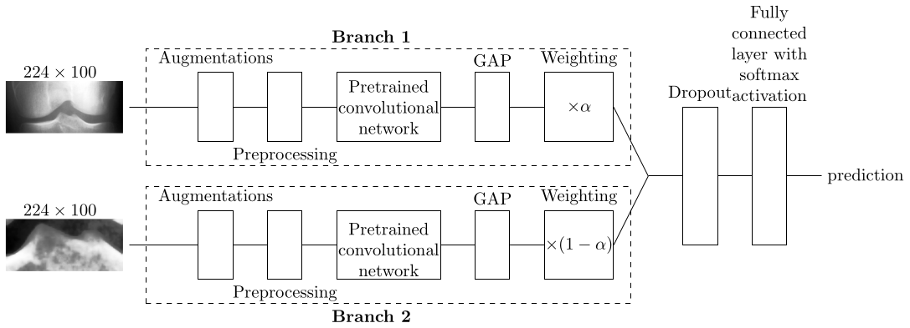

# Multi-scale network for diagnosing knee osteoarthritis

## Info

**Note!** This is a `weighted` branch. For dependencies and other details, see the `main` branch.

The weighted multi-scale network has two branches. The branch processing the knee joint images has weight $\alpha$, and the one processing the tibial tubercle images has weight $1-\alpha$. See the image below. GAP means global average pooling, and $0 \leq \alpha \leq 1$.

## Training the network

The command for using `parallel_train.py` is exactly as with the non-weighted multi-scale network (`main` branch). The only difference is that now the grid search is performed over several values for $\alpha$. Which values of $\alpha$ are used, is specified in the code.

## Testing the network

Testing works as in the `main` branch, except that now you also have to specify `alpha`, i.e. $\alpha$.