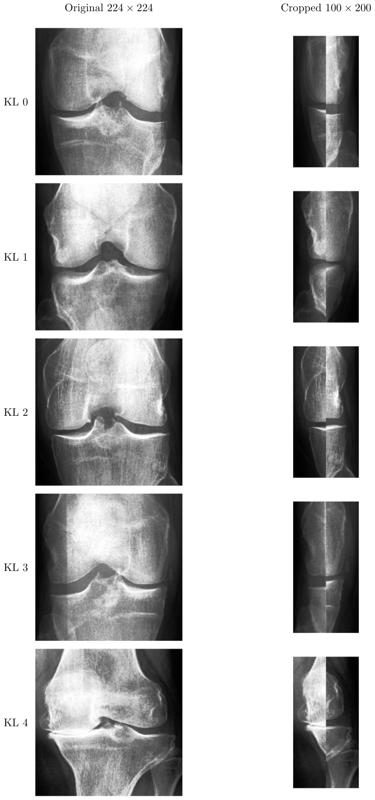
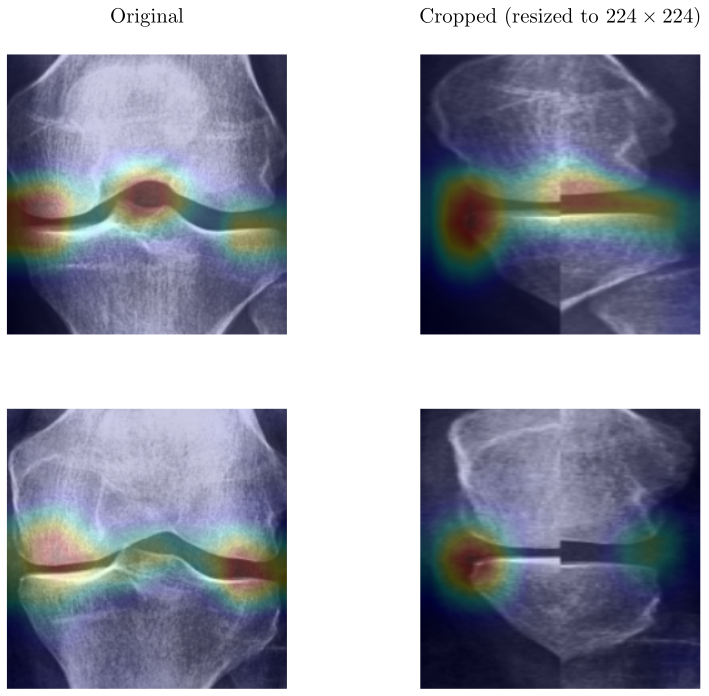
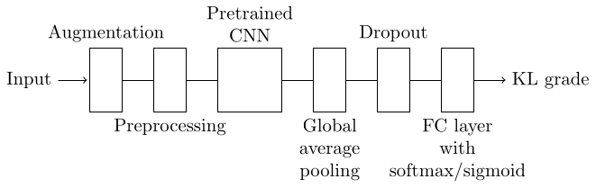

# Using the relevant parts of the X ray image to classify knee osteoarthritis

## The idea

Neural network based knee KL classifiers are usually trained using (center cropped) PA X-ray images. However, these images contain excessive information. We implemented a KL classification pipeline using cropped images with only lateral and medial edges. Our network can also handle the non-cropped images, which makes it possible to compare the results.



As we can see from the Grad-CAM images below, it is no surprise that lateral and medial edges are important. However, exclusion of intercondylar tubercles did not worsen the results, even though neural networks occasionally focus on them, too.



## Dependencies

- Python 3.13
- PyTorch 2.8.0
- Torchvision 0.23.0
- NumPy 2.2.6
- Scikit-image 0.25.2
- Scikit-learn 1.7.1
- Matplotlib 3.10.5
- Grad-CAM 3.10.5 (installable via `pip`: `pip install grad-cam`)

## The data

The images are from Osteoarthritis Initiative (OAI), organized by Chen and available in [Kaggle](https://www.kaggle.com/datasets/shashwatwork/knee-osteoarthritis-dataset-with-severity). After unzipping, the directory hiearchy will be as follows:

```
archive
|--- test
|    |--- 0
|    |--- 1
|    |--- 2
|    |--- 3
|    |--- 4
|--- train
|    |--- 0
|    |--- 1
|    |--- 2
|    |--- 3
|    |--- 4
|--- val
|    |--- 0
|    |--- 1
|    |--- 2
|    |--- 3
|    |--- 4
```

Subdirectories `0`, `1`, `2`, `3`, and `4` contain $224\times 224$ grayscale images.
The data icludes also `auto_test` dir that was not used in our research and is thus omitted.

To prepare the data, issue command

```
python prepare_data.py path/to/archive/ path/to/non-cropped/ path/to/cropped/
```

where `path/to/archive/` is root directory of the data. The histogram-equalized images will be saved to `path/to/non-cropped/`. Histogram-equalized images will also be cropped and saved to `path/to/cropped/`. You can use absolute or relative paths, and the directories `path/to/non-cropped` and `path/to/cropped/` will be created if they don't exist. If you use the network for other than the conventional 5-class classification, you must structure the directiories accordingly. For example, you should remove the subdirectories `3` and `4` if you use only classes 0, 1, and 2.


## The network

### Structure

The structure of our network is presented in the figure below.



Pretrained CNNs are at the moment

- DenseNet-121
- MobileNet V3
- ResNet-50
- VGG-16
- Inception V3.


### Training

Training script is `train.py`. It performs a grid search (varying base model, optimizer, and learning rate) with early stopping. To train, issue
```
python train.py n_classes train_dir val_dir
```
Command line arguments are as follows:

- `n_classes`: number of classes.
- `train_dir`: path to training data directory. For example, `path/to/non-cropped/train/`.
- `val_dir`: path to validation data directory. For example, `path/to/non-cropped/val/`.
- `--gpu_id`: index of GPU (optional). Defaults to 0.

The images can be either whole images or cropped ones. They will be preprocessed (including resizing) to meet the requirements of the pretrained CNN.

### Grid search log files

The automatically generated grid search directory could be e.g.

```
gs_5-class_25-04-07-144040
```

This tells the number of classes and the starting date and time. The directory contains

- `training.log`: training log file
- `configs`: list of the hyperparameter configurations
- `results`: validation results for every configuration
- models' weights as `.pt` files.


### Testing

You have to specify the test image directories, model weights, and what CNNs to use. See the comments in the `main()` function in `test.py`. Then execute the test script:

```
python test.py
```

### Heatmaps

The command line arguments are as follows:

- `base_model`: name of the convolutional base. Possible values are `densenet-121`, `mobilenet_v3`, `resnet-50`, `vgg-16`, and `inception_v3`.
- `src_rootdir`: source root directory for images.
- `dst_rootdir`: destination root directory. The heatmaps will be generated here. If it does not exist, it will be created.
- `--weights_path`: path to the model weights (optional). Defaults to an empty string, meaning ImageNet weights in the CNN and random weights in the classification head.
- `--image_weight`: weight of the original image in the heatmap (optional). Defaults to 0.8.
