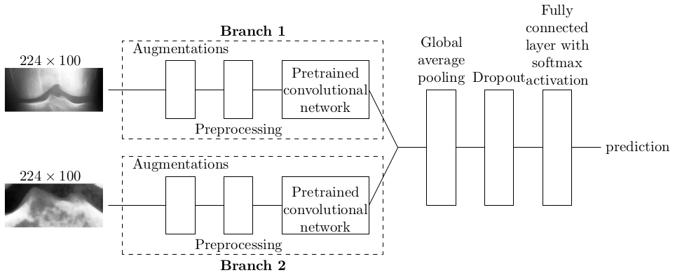
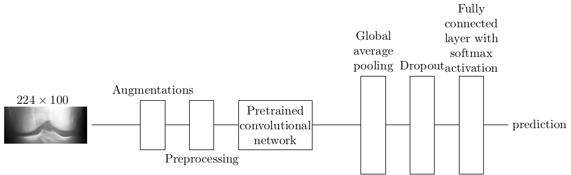

# Multi-scale network for diagnosing knee osteoarthritis

## Info

Spiking of tibial tubercles has been hypothesized to be an early sign of knee osteoarthritis. Our multi-scale approach is aimed to make neural network pay attention to tibial tubercles as well as the knee joint in general. The network has two branches, as illustrated in the figure below.



For comparison, we also have a single-branch network, illustrated below.




Our manually cropped dataset is available at [Mendeley Data](https://data.mendeley.com/datasets/6gbptmgp3y/1).


## Dependencies

- Python 3.11
- CUDA Toolkit 11.8.0
- cuDNN 8.9.2.26
- CUDA NVCC 12.3.107
- TensorFlow 2.14
- Scikit-image 0.22
- Scikit-learn 1.3.2
- Matplotlib 3.8.

Other versions may work too, but the configuration above has been tested.

## Training the network

There are two training scripts: `single_train.py` for single-branch and `parallel_train` for two-branch network. Both of them perform a grid search varying learning rate and dropout rate. Input images are supposed to be of size $224\times 100$. Both networks can be trained to do classification with data of $n\geq 2$ classes, but of course the directory hierarchy must have been structured accordingly. This property is useful, if some KL classes are merged. For traditional 5 KL classes, the directory hierarchy could be as follows:
```
data
|--- train
|    |--- 0
|    |--- 1
|    |--- 2
|    |--- 3
|    |--- 4
|--- val
|    |--- 0
|    |--- 1
|    |--- 2
|    |--- 3
|    |--- 4
|--- test
|    |--- 0
|    |--- 1
|    |--- 2
|    |--- 3
|    |--- 4
```

### Single-branch network

Let us start with a simpler network. To train the single-branch network, issue

```
python single_train.py base_model dir_train dir_val
```

where `base_model` is the base convolutional network, `dir_train` training directory, and `dir_val` validation directory. Base model can be one of the following:

- `vgg-16`
- `vgg-19`
- `inception_v3`
- `xception`
- `densenet-121`
- `densenet-169`
- `mobilenet_v2`
- `resnet-50`.

There are also optional arguments:

- `--gpu-id`: index of GPU. Might be useful in case there are multiple GPU's. Defaults to 0.
- `--n_save`: how many models are saved. After training, weights of the `n_save` best models are saved. The models's performance is compared by their validation accuracy. Defaults to 1.
- `--classes`: number of classes. Defaults to 5.
- `--weights`: weights of the convolutional base. Defaults to `'imagenet'`.
- `--bsize`: batch size. Defaults to 16.
- `--epochs`: maximum number of epochs. The training script uses early stopping with patience of 10 epochs, but this is the upper limit. Defaults to 200.

### Multi-scale network

Training the multi-scale network is just a little more complicated, because now we need two directories for training and validation data. The same kind of convolutional base is used in both of the branches. To train the multi-scale network, issue

```
python parallel_train.py base_model dir1_train dir2_train dir1_val dir2_val
```

The optional arguments are like in the single-branch case above, except that `--bsize` defaults to 8.

### Training log

The grid search directory could be e.g.
```
parallel-5-class_vgg-19_24-07-01-092047
```

This tells that we have been or are training a parallel (instead of single) network, the data has 5 classes, and the base model is VGG-19. The name also tells the starting time. The directory contains training log `training.log` and, after the training, the model's weights as `.h5` files. The training log seems like

```
Configuration 0: {'base_model': 'vgg-19', 'dropout': 0, 'lr': 0.0001, 'weights': 'imagenet'}
0,0.38981446623802185,1.444081425666809,0.4077155888080597,1.3707553148269653
1,0.43752366304397583,1.2919057607650757,0.4576399326324463,1.3004432916641235
2,0.4969708323478699,1.153167724609375,0.5196671485900879,1.187622308731079

```

The first row specifies the hyperparamaters of the configuration at hand. The next rows have number of epoch, training accuracy, training loss, validation accuracy, and validation loss.

## Testing the network

To test the single-scale network, modify the `main()` method in `single_test.py`. You must assign values to the following variables in the method:

- `base_model`: the base convolutional network (as above).
- `dir_test`: directory containing the test data.
- `weights_path`: path to the `.h5` file.
- `classes`: number of classes (as above).
- `batch_size`: batch size.
- `report_dir`: directory where you want the test results to be saved.

The same applies to the `main()` method in `parallel_test.py`, except that now there are two directories for the test data: `dir1_test` and `dir2_test`. The testing script will save the classification results in text file `results.txt` and the confusion matrix in `conf_matrix.png` inside `report_dir`.
